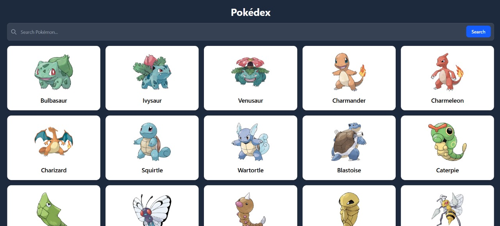

# 🧿 Modern Pokédex with React and Tailwind

A sleek and responsive Pokédex application built using **React** and **Tailwind CSS**. This project pulls live data from the [PokéAPI](https://pokeapi.co/) to display comprehensive Pokémon information in an intuitive, Pokédex-style interface.

---

## 📸 Preview



---

## 🚀 Features

- 🔍 **Search with Autocomplete**  
  Type a Pokémon's name to instantly view matching results in a dropdown.

- 📘 **Detailed Pokémon Pages**  
  View type icons, official artwork, height, weight, abilities, evolution chain, weaknesses, base stats, and flavor text.

- 🎨 **Responsive Design**  
  Built with Tailwind CSS for a clean and adaptive UI.

- ⚛️ **React Router Integration**  
  Smooth navigation between the homepage and individual Pokémon pages.

---

## 🛠️ Tech Stack

- **React** – UI rendering and routing  
- **Tailwind CSS** – Utility-first styling  
- **Axios** – Data fetching  
- **PokéAPI** – Source for all Pokémon data  

---

## 🧩 Getting Started

### 📦 Install Dependencies

```bash
npm install